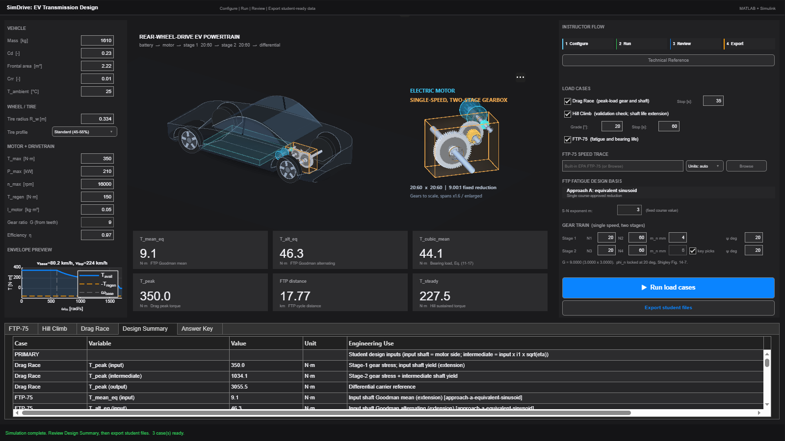
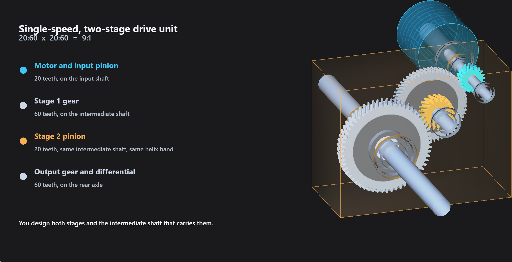
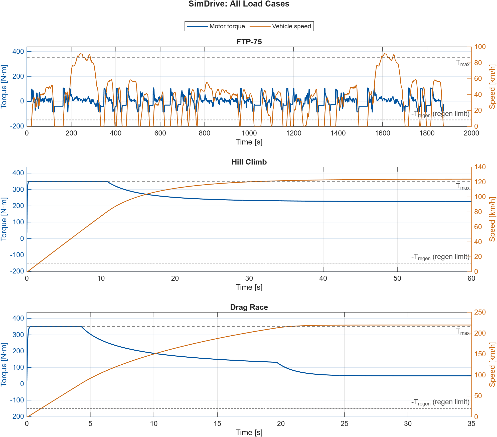

# SimDrive: EV Transmission Design
### Design the two-stage gearbox of a passenger EV with Shigley, from torques a Simulink model of the car produces

[](https://www.mathworks.com/products/matlab.html)
[](https://www.mathworks.com/products/simulink.html)
[](CHANGELOG.md)
[](https://github.com/ahmedibrahim-aus/SimDrive-EV-transmission/actions/workflows/matlab-tests.yml)
[](LICENSE)
[](LICENSE-docs)

A machine design project for third- and fourth-year mechanical engineering
students, built on *Shigley's Mechanical Engineering Design*, 11th edition.
Students carry out the AGMA rating of two helical gear stages, the fatigue and
yield design of a stepped shaft, and the selection of deep-groove ball bearings
from a manufacturer's catalog. The loads are not handed to them: they come
from a MATLAB and Simulink model of the vehicle driving a full-throttle launch
(the Drag Race case), the EPA FTP-75 city cycle and a long hill climb.

**Instructors:** the worked answer key is encrypted in this repository; see
[The reference solution](#the-reference-solution) for how to obtain the password.



## The machine at a glance

| Item | Value |
|---|---|
| Vehicle | Rear-wheel-drive passenger EV, 1610 kg, `C_d` 0.23, frontal area 2.22 m², tire radius 0.334 m |
| Motor | 350 N·m peak torque, 210 kW, 16,000 rpm speed limit (base speed 80 km/h, top speed 224 km/h) |
| Transmission | Single speed, two helical stages, 20:60 then 20:60, overall ratio 9:1, 20° normal pressure angle |
| What students design | Both gear meshes, the intermediate shaft that carries them, and its two bearings |
| Design life | 150,000 km |
| Safety-factor targets | Bending 1.5, contact 1.2, shaft fatigue and yield 1.5 at every critical section |



## What the project adds

**The loads come from a vehicle, not from the problem statement.** Each torque
belongs to a different failure mode, and choosing the right one is part of the
design. The launch gives the peak torque that sizes the gear teeth and the
static yield check. The city cycle, reduced by rainflow counting, gives the
mean and alternating torques for the modified Goodman criterion and the cubic-mean
torque for bearing rating life (Shigley Eq. (11-17)). The hill climb gives a steady
torque that students first use to check the simulation by hand.

**Students check the model before they trust it.** On the hill the motor
settles on its power limit, so the steady torque has a closed-form solution.
Students solve the force balance themselves and compare it with the simulated
value, which agrees to within one percent, before they use any number from
the model.

**Every step names its source in the text.** The templates and the reference
solution cite the chapter, equation, figure or table behind each calculation.
For example, the contact stress in each stage is Shigley Eq. (14-16), with the
dynamic factor from Eq. (14-27), the quality number checked against Eq. (14-29),
and the geometry factor `J` read from Figs. 14-7 and 14-8. The full map is in
[`docs/SHIGLEY_EQUATION_MAP.md`](docs/SHIGLEY_EQUATION_MAP.md).

**The answer key follows the instructor's choices.** Change the tooth
counts, modules, helix angles or the vehicle, and the dashboard recomputes the
reference solution for that gear train. Different sections or years can
receive different numbers from the same module.



## What it covers from Shigley

| Shigley 11e | Topic | Where students use it |
|---|---|---|
| Ch. 3 | Reactions, shear force and bending moment diagrams in two planes | Intermediate shaft |
| Ch. 5 | Distortion-energy theory for static failure | Shaft yield at the peak torque |
| Ch. 6 | Endurance limit, Marin factors, notch sensitivity, modified Goodman, S-N line | Shaft fatigue; finite life as an extension |
| Ch. 7 | Stepped shaft layout, critical sections, the DE-Goodman shaft equations | Intermediate shaft |
| Ch. 11 | Equivalent radial load, Table 11-1 factors, variable loading, `L10` rating life | Bearing selection |
| Ch. 13 | Helical gear geometry, force analysis, helix hand on a common shaft | Both gear stages and the shaft loads |
| Ch. 14 | AGMA bending and contact stress, every rating factor | Both gear stages |
| App. A | Stress-concentration charts A-15-7 to A-15-9, Table A-21 steels | Shaft shoulders and materials |

## What students do

1. **Load the data** (`Student_01`). Match each torque to the failure mode it
   governs, carry it to the input, intermediate and output shafts, and check the
   hill-climb torque by hand.
2. **Rate both gear stages** (`Student_02`). Choose the face width, material and
   every AGMA factor with a stated source, and reach the bending and contact
   targets on all four gears.
3. **Design the intermediate shaft** (`Student_03`). Lay out a stepped shaft for
   minimum mass and check fatigue and yield at every critical section, including
   the two helix thrust couples.
4. **Select the bearings** (`Student_04`) from the SKF catalog for 150,000 km
   of rating life, and show a candidate that fails.
5. **Write the report**, including at least one documented design iteration.

Optional extensions are the input shaft and a finite-life check: how many
hours of full-power hill climbing the shaft survives.

The templates give the method and the equations but no numbers. Every choice
is the student's to make and justify. The design is iterative, and what
counts as a good design depends on the constraints the instructor sets in the
project document.

## How to use it in a course

- **Term project.** Release each part as its chapter is taught: gears after
  Ch. 13 and 14, the shaft after Ch. 6 and 7, the bearings after Ch. 11.
- **Two- to three-week assignment.** Assign one part with a short report. The
  upstream results can be handed out as given data, as an engineer receives
  loads from another group.
- **Lecture example.** Where design loads come from, and why a component can
  see a large torque a few times and a small one millions of times.
- **Design review.** Which check sizes each part, and what that says
  about the assumptions behind it.

## Quick start

```matlab
% In MATLAB, from the repository folder
cd instructor
Start_Here            % checks the installation and opens the dashboard
```

In the dashboard, keep the defaults or set your own car and gear train, press
**Run load cases** (about two minutes for all three cases on a desktop PC),
then **Export student files**. Hand students the `student_package/` folder or
the ZIP in `release/`. It holds the project brief, the four templates, the
simulation data and the student documents, and never the solution.

From the command line instead, run `generateLoadCases` in `instructor/` (it clears the base workspace), then
`buildStudentPackage` in `tools/`. More detail is in
[`docs/QUICKSTART.md`](docs/QUICKSTART.md) and the
[instructor guide](docs/INSTRUCTOR_GUIDE.md).

## The reference solution

A complete worked solution, the reference results and the tests that check
them ship in an encrypted archive, `instructor_answer_key.7z` (AES-256), so that
students who find this repository cannot read them.

> **Answer key for instructors:** email Dr. Ahmed Hanafy Ibrahim at
> [ahmedibrahim@aus.edu](mailto:ahmedibrahim@aus.edu?subject=SimDrive%20answer%20key%20request)
> from your institutional email address, with your name, institution and
> the course you teach, and you will receive the password.

Extract the archive in the repository folder (7-Zip, or
`7z x instructor_answer_key.7z`), and the dashboard then computes the answer
key for every export and writes `exports_design_ready/Answer_Key.md`.
Everything else, including the dashboard and the student package, works
without the password.

**The solution is for reference only.** It is one valid design, not the
answer. Students who make different, well-justified choices of face width,
material, rating factors, shaft layout or bearing will reach different numbers
and can be equally correct. Use it as a starting point, to check orders of
magnitude, and to support grading.

## Frequently asked questions

**What do I need to run it?** MATLAB R2025a or newer, Simulink, and the Signal
Processing Toolbox (for rainflow counting). It is tested on R2025b and R2026b
on Windows, and on R2025b on Linux in CI; R2025a has not been tested. Run `check_dependencies` in `instructor/` on a new machine.

**Can I change the car or the gearbox?** Yes. The mass, drag, tire, motor
torque, power and speed limit, and the teeth, modules and helix angle of both
stages are all inputs. Gear trains outside the range of Shigley's charts are
refused, with the reason.

**Can students see the solution?** No. The student package never contains it,
and in this repository it is encrypted. Instructors can request the password
(see [The reference solution](#the-reference-solution)). To give different
sections different numbers, vary the gear train or the vehicle.

**Does it run in MATLAB Online?** It has not been tested there yet.

**Which book do I need?** *Shigley's Mechanical Engineering Design*, 11th
edition. Equation, figure and table numbers follow that edition.

## Limitations

This is a teaching model, not a validated vehicle simulator or a production
gearbox design. The main simplifications, each stated to students:

- A point-mass vehicle with constant drivetrain efficiency, no tire slip and no
  thermal derating.
- The city-cycle torque is reduced to one equivalent sinusoid for the Goodman
  check.
- The gear quality number is checked at 120 km/h; near top speed the stage-1
  pinion would run faster than Shigley's Fig. 14-9 covers.
- Press fits and keys are assumed to add no stress concentration.
- Bearing life is the 90 percent `L10` rating life, with no reliability or
  application factor.
- The reference solution takes the AGMA size factor as 1, which Shigley permits,
  and its helical face-contact ratios are below the value of 2 that Figs. 14-7
  and 14-8 assume.

The full list is in [`docs/MathematicalModels.md`](docs/MathematicalModels.md).

## Feedback

Please [open an issue](https://github.com/ahmedibrahim-aus/SimDrive-EV-transmission/issues)
to tell us which parts you assigned and what your students found hard, or to
report a problem. See [`CONTRIBUTING.md`](CONTRIBUTING.md).

## Authors

**Dr. Ahmed Hanafy Ibrahim**, Assistant Professor, American University of
Sharjah (ahmedibrahim@aus.edu), corresponding author. **Mahmoud Al Herbawi** and **Malek Zahir**, senior
undergraduate students. Supported by the MathWorks Teaching Support Award.

The MATLAB Agentic Toolkit was used with Anthropic's Claude and OpenAI's
Codex for testing and to accelerate the development of the instructor
dashboard (GUI).

## License

Software: BSD-3-Clause ([`LICENSE`](LICENSE)). Course materials and
documentation: CC BY-SA 4.0 ([`LICENSE-docs`](LICENSE-docs)).

<details>
<summary><strong>Citation</strong></summary>

```bibtex
@misc{ibrahim2026evgearbox,
  author    = {Ibrahim, Ahmed Hanafy and Al Herbawi, Mahmoud and Zahir, Malek},
  title     = {{SimDrive: EV Transmission Design}},
  version   = {4.0.0},
  year      = {2026},
  publisher = {GitHub},
  url       = {https://github.com/ahmedibrahim-aus/SimDrive-EV-transmission}
}
```

</details>

<details>
<summary><strong>References</strong></summary>

1. Budynas, R. G., and Nisbett, J. K. *Shigley's Mechanical Engineering Design*, 11th ed. McGraw-Hill, 2020.
2. ANSI/AGMA 2101-D04. *Fundamental Rating Factors and Calculation Methods for Involute Spur and Helical Gear Teeth*.
3. SKF Group. *Rolling bearings*, PUB BU/P1 17000/1 EN. 2021.
4. US EPA. *Federal Test Procedure (FTP-75) urban dynamometer driving schedule*.
5. Gillespie, T. D. *Fundamentals of Vehicle Dynamics*. SAE International, 1992.
6. ASTM E1049-85 (2017). *Standard Practices for Cycle Counting in Fatigue Analysis*.

</details>
